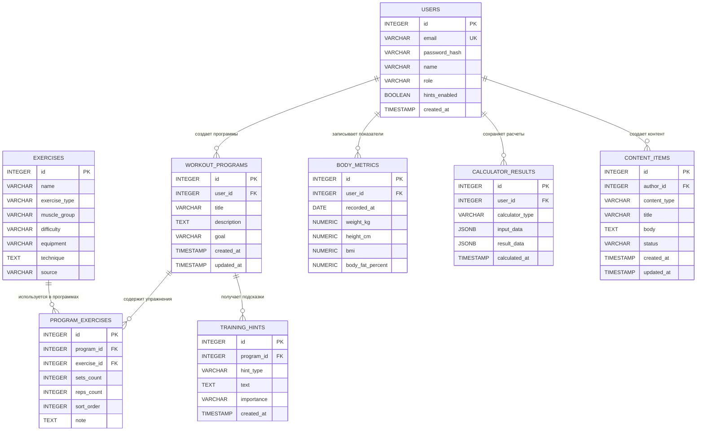

# ERD-диаграмма проекта F-easy

F-easy — фитнес-сайт, где пользователь может смотреть каталог упражнений, собирать тренировочные программы, получать подсказки и отслеживать прогресс.

## Mermaid ERD

## Описание связей

| Связь | Тип | Описание |
|-------|-----|----------|
| Users -> WorkoutPrograms | 1:N | Один пользователь может создать много тренировочных программ, но каждая программа принадлежит одному пользователю |
| WorkoutPrograms -> ProgramExercises | 1:N | Одна программа может содержать много упражнений с настройками подходов, повторений и порядка |
| Exercises -> ProgramExercises | 1:N | Одно упражнение из каталога может использоваться во многих тренировочных программах |
| WorkoutPrograms -> TrainingHints | 1:N | Для одной программы может быть создано несколько подсказок умного помощника |
| Users -> BodyMetrics | 1:N | Один пользователь может сохранять много записей с параметрами тела по разным датам |
| Users -> CalculatorResults | 1:N | Один пользователь может сохранить много результатов калькуляторов; для гостя user_id может быть NULL |
| Users -> ContentItems | 1:N | Один администратор или автор может создать много материалов |
| WorkoutPrograms <-> Exercises | M:N | Программа может содержать много упражнений, а одно упражнение может входить во многие программы. Эта связь реализована через промежуточную таблицу ProgramExercises |

## Внешние ключи

| Таблица | Поле | Ссылка |
|---------|------|--------|
| WorkoutPrograms | user_id | Users.id |
| ProgramExercises | program_id | WorkoutPrograms.id |
| ProgramExercises | exercise_id | Exercises.id |
| TrainingHints | program_id | WorkoutPrograms.id |
| BodyMetrics | user_id | Users.id |
| CalculatorResults | user_id | Users.id |
| ContentItems | author_id | Users.id |

## Вопросы для самопроверки

1. Чем связь 1:N отличается от M:N? Приведите пример каждой из вашего проекта.

Связь 1:N означает, что одна запись может иметь много связанных записей, но каждая из этих записей относится только к одной основной записи. Например, один User может иметь много WorkoutPrograms. Связь M:N означает, что много записей одной таблицы могут быть связаны со многими записями другой таблицы. Например, WorkoutPrograms и Exercises: одна программа содержит много упражнений, и одно упражнение может использоваться во многих программах.

2. Почему связь M:N нельзя реализовать двумя таблицами? Зачем нужна промежуточная?

Если хранить M:N только в двух таблицах, будет непонятно, где хранить несколько связей между ними. Промежуточная таблица нужна, чтобы каждая связь была отдельной записью. В проекте F-easy таблица ProgramExercises связывает WorkoutPrograms и Exercises, а также хранит sets_count, reps_count, sort_order и note.

3. Что будет, если удалить запись, на которую ссылается FK?

Обычно база данных не даст удалить такую запись, пока на неё ссылаются другие строки. Например, нельзя просто удалить пользователя, если у него есть программы, если не настроено каскадное удаление или предварительное удаление связанных данных.

4. Может ли FK быть NULL? Когда это полезно?

Да, FK может быть NULL, если связь необязательная. Например, CalculatorResults.user_id может быть NULL для результата калькулятора, который получил гость без регистрации.
